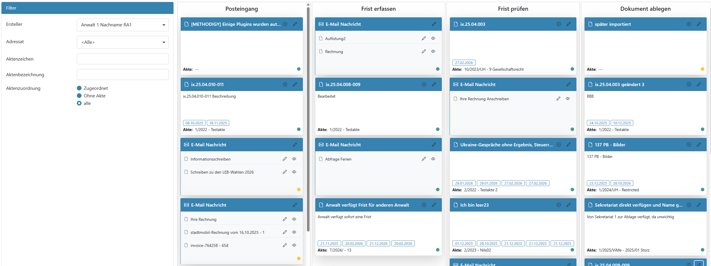

# 03 – Kanban: Arbeitssteuerung

Das Kanban-Board ist die zentrale Sicht zur **Steuerung der täglichen Arbeit** im WFT.  
Hier sehen Sie auf einen Blick, welche Dokumente neu eingegangen sind, in Bearbeitung stehen oder abgeschlossen werden können.

> **Hinweis:**  
> Der grundlegende Ablauf eines Dokuments ist in Kapitel 02.1 (Der Geradeausprozess) beschrieben.

---

## 03.1 Was ist das Kanban-Board?

Das Kanban-Board stellt alle eingehenden Dokumente als **Karten** dar.  
Jede Spalte entspricht einem **Bearbeitungsstatus**.

Ein Dokument wandert von links nach rechts durch den Bearbeitungsprozess – vom Posteingang bis zur Ablage.

---

## 03.2 Posteingang sichten

In der Spalte **Posteingang** erscheinen alle neu eingegangenen Dokumente.

Typische Aufgaben in diesem Schritt:
- Dokumente sichten
- Zuständigkeit festlegen (Adressat / Ersteller)
- Entscheiden, ob das Dokument fristrelevant ist

Der Posteingang ist der Startpunkt für alle weiteren Schritte.

---

## 03.3 Karten verschieben und Status wechseln

Der Bearbeitungsstatus eines Dokuments wird geändert, indem eine Karte:
- per Drag & Drop in eine andere Spalte gezogen wird
- im Editor über eine Schaltfläche gewechselt wird

Typische Statuswechsel:
- **Posteingang → Frist erfassen** (fristrelevant)
- **Posteingang → Dokument ablegen** (nicht fristrelevant)
- **Frist erfassen → Frist prüfen** (Fristen erfasst, zur Prüfung bereit)
- **Frist prüfen → Dokument ablegen** (Fristen geprüft, zur Ablage bereit)

Beim Wechsel in bestimmte Status öffnet sich automatisch der **Editor**, um notwendige Angaben zu erfassen oder zu prüfen.

> Details zur Bearbeitung im Editor finden Sie in Kapitel 04.

---

## 03.4 Gruppierte Bearbeitung im Kanban

Mehrere Dokumente können gleichzeitig bearbeitet werden.

Dazu können:
- durch das Bewegen einer Gruppenkarte mehrere Dokumente gemeinsam in den nächsten Status gezogen werden
- durch die Bearbeitung im Gruppeneditor mehrere Dokumente gleichzeitig angepasst werden

Je nach Zielstatus öffnet sich anschließend der **Gruppeneditor**.

> Details zum Gruppeneditor finden Sie in Kapitel 04.5.

---

## 03.5 Rolle von Anwälten und Sachbearbeitung

Das Kanban-Board unterstützt die arbeitsteilige Zusammenarbeit:

- **Sachbearbeitung**
  - sichtet den Posteingang
  - erfasst Stammdaten und Fristen
  - bereitet Dokumente zur Prüfung vor
  - bereitet Dokumente zur Ablage vor
  - überwacht ggf. Fristen des zugeordneten Anwalts

- **Anwälte**
  - prüfen Fristen
  - prüfen die Erledigung von Fristen
  - geben Dokumente fachlich frei

> Anwälte können jederzeit selbst Karten verschieben oder bearbeiten.  
> Der Regelfall ist jedoch die vorbereitende Arbeit durch das Sekretariat.

---

## 03.6 Wie es weitergeht

Je nach Status arbeiten Sie anschließend mit:

- dem **Editor** zur Detailbearbeitung (Kapitel 04)
- der **Fristenbearbeitung** für fristrelevante Dokumente (Kapitel 05)
- der **Ablage** zur abschließenden Archivierung (Kapitel 06)
