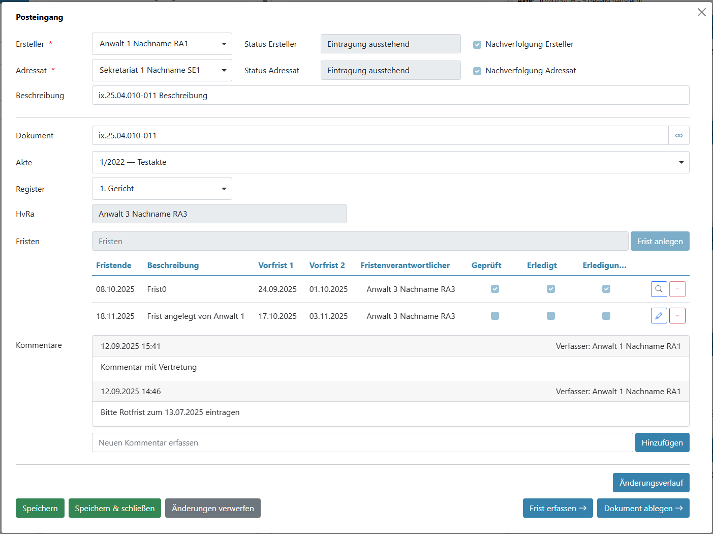
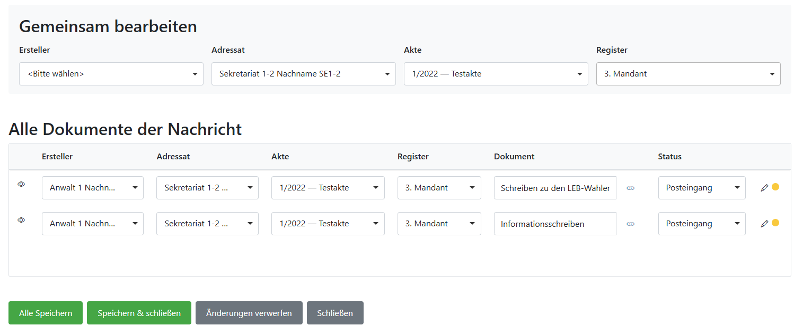

# 04 – Editor: Dokumentbearbeitung

Der Editor ist die zentrale Arbeitsmaske zur **inhaltlichen Bearbeitung von Dokumenten** im WFT.  
Er wird in der Regel aus dem Kanban-Board heraus geöffnet und begleitet Dokumente durch die nächsten Bearbeitungsschritte.

> **Hinweis:**  
> Wann ein Dokument in welchen Bearbeitungsschritt gelangt, ist im Kanban beschrieben (Kapitel 03).

---

## 04.1 Karten und Gruppenkarten – ein wichtiger Unterschied

Im Kanban-Board gibt es zwei Arten von Einträgen:

### Einzelkarte (Karte)
- steht für **ein einzelnes Dokument**
- öffnet beim Bearbeiten immer den **Editor für dieses Dokument**

### Gruppenkarte
- steht für **eine Gruppe zusammengehöriger Dokumente**
- enthält die einzelnen Dokumente der Gruppe
- ermöglicht eine **gemeinsame Bearbeitung auf Gruppenebene**

Gruppen entstehen **nicht manuell im WFT**, sondern werden automatisch aus dem angebundenen Dokumentenmanagementsystem (STP-Documents) übernommen.

> Aktuell existieren Gruppen ausschließlich für  
> **E-Mails** und **beA-Nachrichten**.

---

## 04.2 Was ist der Editor?

Der Editor ist die Bearbeitungsansicht für **ein einzelnes Dokument**.

Im Editor werden alle Informationen gepflegt, die für die weitere Bearbeitung und Ablage erforderlich sind:

- Zuständigkeiten (Adressat, Verantwortlicher)
- Akten- und Registerzuordnung
- Fristen
- Kommentare und Hinweise
- statusabhängige Aktionen

Der Editor wird geöffnet, indem:
- das **Bearbeiten-Symbol einer Karte**
- oder das **Bearbeiten-Symbol eines einzelnen Dokuments innerhalb einer Gruppe**
angeklickt wird.

---

## 04.3 Zuständigkeiten und Stammdaten

### Zuständigkeiten

Im oberen Bereich des Editors werden die Zuständigkeiten festgelegt:

- **Adressat**  
  In der Regel eine Person aus dem Sekretariat, die die operative Bearbeitung übernimmt.

- **Ersteller / Verantwortlicher**  
  Meist der zuständige Anwalt mit fachlicher Verantwortung.

Diese Zuordnung ist wichtig für:
- die weitere Bearbeitung
- die Nachverfolgung
- spätere Rückfragen

---

### Akte und Register

Jedes Dokument wird einer **Akte** und einem **Register** zugeordnet.

- Die Akte bestimmt den fachlichen Zusammenhang
- Das Register legt fest, wo das Dokument abgelegt wird

Sind Akte und Register vollständig gepflegt, kann die Ablage später **automatisch** erfolgen.

> Details zur Ablage finden Sie in Kapitel 06.

---

## 04.4 Fristen im Editor

Ist ein Dokument fristrelevant, erfolgt die Fristenbearbeitung direkt im Editor.

Hier können:
- bestehende Fristen eingesehen
- neue Fristen hinzugefügt
- Vorfristen gepflegt
- Fristen als geprüft oder erledigt markiert werden

Die fachliche Einordnung und Prüfung der Fristen wird in Kapitel 05 erläutert.

---

## 04.5 Kommentare und Abstimmung

Der Kommentarbereich dient der **internen Kommunikation** zwischen Sachbearbeitung und Anwälten.

Typische Anwendungsfälle:
- Hinweise zur Frist
- Rückfragen zur Zuordnung
- kurze Abstimmungen

Kommentare:
- werden chronologisch gespeichert
- sind für alle Beteiligten sichtbar
- bleiben dauerhaft am Dokument

---

## 04.6 Gruppenbearbeitung über Gruppenkarten

Bei Gruppenkarten kann die Bearbeitung auf zwei Arten erfolgen:

### Einzelnes Dokument aus einer Gruppe bearbeiten
- Auswahl eines konkreten Dokuments innerhalb der Gruppe
- Öffnung des normalen Editors für dieses Dokument

### Gruppe bearbeiten
- Auswahl des Bearbeiten-Symbols der **Gruppenkarte**
- Öffnung einer **Gruppenbearbeitung** für alle enthaltenen Dokumente

Die Gruppenbearbeitung ermöglicht:
- effiziente Bearbeitung zusammengehöriger Dokumente
- konsistente Zuordnung innerhalb der Gruppe

Nicht alle Felder sind in der Gruppenbearbeitung editierbar.  
Je nach Dokumentenstatus sind bestimmte Felder gesperrt. Diese werden auch bei einer Gruppenbearbeitung nicht verändert.
Bearbeitbare Felder sind aktiv und können für alle Dokumente der Gruppe gleichzeitig gepflegt werden, oder auch individuell pro Dokument.

> **Wichtig:**  
> Dokumente können **nicht manuell zu Gruppen zusammengefasst** werden.  
> Die Gruppierung erfolgt ausschließlich über das DMS (STP-Documents).

---

## 04.7 Aktionen und Statuswechsel

Je nach Bearbeitungsstand stehen im Editor unterschiedliche Aktionen zur Verfügung, z. B.:

- Speichern
- Speichern und schließen
- Änderungen verwerfen
- Status wechseln

Der eigentliche Statuswechsel erfolgt in der Regel über das **Kanban-Board**.  
Bestimmte Aktionen stehen jedoch auch direkt im Editor zur Verfügung.

---

## 04.8 Wie es weitergeht

Nach der Bearbeitung im Editor folgt in der Regel:

- die **Fristenbearbeitung und -prüfung** (Kapitel 05)
- oder direkt die **Ablage des Dokuments** (Kapitel 06), wenn keine Fristen relevant sind
