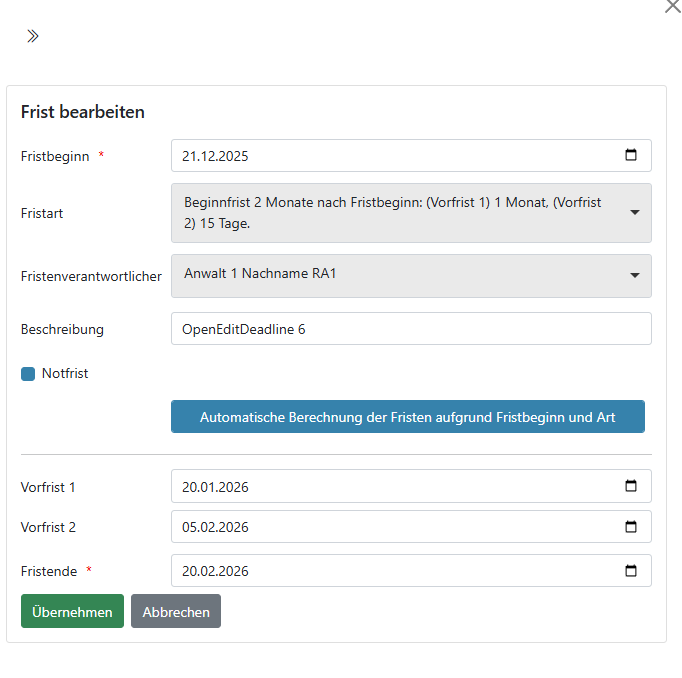

# 05 – Fristenbearbeitung

Die Fristenbearbeitung stellt sicher, dass **rechtlich und organisatorisch relevante Termine** zuverlässig erfasst, geprüft und nachverfolgt werden.  
Sie ist ein zentraler Bestandteil des WFT und läuft **teilweise unabhängig vom Dokumentenworkflow** weiter.

> **Hinweis:**  
> Der Dokumentenworkflow (Kanban) ist in Kapitel 03 beschrieben.  
> Dieses Kapitel beschreibt den **Lebenszyklus einer Frist**.

---

## 05.1 Überblick: Fristen und Dokumente

Ein Dokument kann abgeschlossen und abgelegt sein, während die zugehörigen **Fristen weiterhin aktiv** sind.

Der Fristenworkflow besteht aus mehreren fachlichen Schritten:
1. Frist erfassen
2. Frist prüfen
3. Frist als erledigt kennzeichnen
4. Erledigung prüfen

Diese Schritte werden durch unterschiedliche Rollen durchgeführt.

---

## 05.2 Fristen erfassen

### Zweck
Beim Erfassen wird eine Frist erstmals im System angelegt.

### Wer?
- in der Regel **Sachbearbeitung / Adressat**
- bei Bedarf auch ein **Anwalt**

### Wie?
Die Fristenerfassung erfolgt im **Editor**:
- Auswahl oder Suche nach der passenden Fristart
- Festlegen von Endfrist und ggf. Vorfristen
- Zuordnung eines Fristverantwortlichen
- Erfassen einer Fristbeschreibung

Eine Frist ist nach der Erfassung **noch nicht fachlich geprüft**.

---

## 05.3 Fristen prüfen (fachliche Prüfung)

### Zweck
Die fachliche Prüfung stellt sicher, dass:
- alle relevanten Fristen erfasst wurden
- Fristdaten und Vorfristen korrekt sind
- die Frist der richtigen Akte zugeordnet ist

### Wer?
- **Fristverantwortlicher Anwalt**  
  (in der Regel der hvRa der zugeordneten Akte)

### Ergebnis
Nach erfolgreicher Prüfung wird die Frist als **geprüft** gekennzeichnet.

> Die fachliche Prüfung bezieht sich ausschließlich auf die **Korrektheit der Frist**, nicht auf deren spätere Erledigung.

---

## 05.4 Frist als erledigt kennzeichnen

### Zweck
Mit dem Status *erledigt* wird bestätigt, dass:
- die fristauslösende Handlung durchgeführt wurde  
  (z. B. Schriftsatz erstellt, Antrag eingereicht)

### Wer?
- in der Regel **Sachbearbeitung / Adressat**

Der Schritt *erledigt* ist eine **Arbeitsbestätigung**, keine fachliche Endkontrolle.

---

## 05.5 Erledigung prüfen

### Zweck
Die Prüfung der Erledigung stellt sicher, dass:
- die Frist tatsächlich eingehalten wurde
- die zugrunde liegende Handlung korrekt abgeschlossen ist

### Wer?
- **Fristverantwortlicher Anwalt**

Erst nach dieser Prüfung gilt die Frist fachlich als abgeschlossen.

> In bestimmten Konstellationen ist eine zusätzliche anwaltliche Prüfung erforderlich  
> (Vier-Augen-Prinzip). Dieses wird im System automatisch berücksichtigt.

---

## 05.6 Friststatus – fachliche Bedeutung

- **erfasst** – Frist ist angelegt
- **geprüft** – Frist ist fachlich korrekt
- **erledigt** – Fristauslösende Handlung wurde durchgeführt
- **Erledigung geprüft** – Frist ist vollständig abgeschlossen

Diese Zustände sind **unabhängig vom Dokumentenstatus**.

---

## 05.7 Fristen und Gruppen

Bei **Gruppenkarten** (z. B. E-Mails oder beA-Nachrichten) gilt:
- Fristen werden **immer dokumentbezogen** bearbeitet
- Gruppenbearbeitung dient lediglich der Übersicht und Navigation

---

## 05.8 Wie es weitergeht

Fristen werden fortlaufend überwacht, auch nachdem Dokumente abgelegt wurden.

Eine zentrale Übersicht über alle Fristen bietet die **Fristenübersicht**,  
die in einem eigenen Kapitel beschrieben wird.
